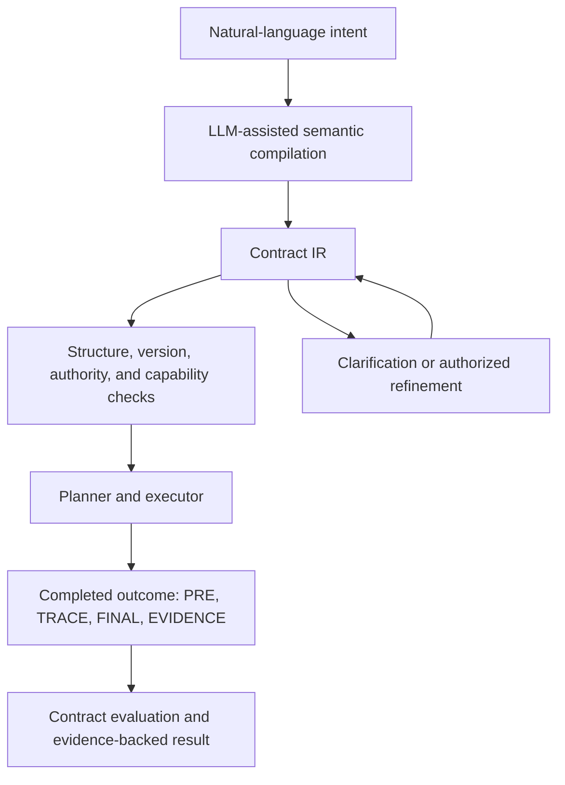

# Semantic Compiler

English | [简体中文](README_CN.md)

Natural-language agents are capable, but their instructions are an unstable
interface: equivalent requests can produce different behavior, important
constraints can remain implicit, and uncertainty can be silently replaced by a
plausible guess. This project investigates whether a **Contract IR** can act as
a semantic boundary between what a person means and what an agent does.

The long-term goal is to compile free-form intent into an explicit, refinable
contract before execution. The contract records requirements, permissions,
unresolved choices, provenance, and evidence obligations in a form that
deterministic components can validate and inspect.

> Can a small domain-independent constraint language, extended by versioned
> domain semantics, preserve human intent well enough to make AI execution more
> consistent, inspectable, and reliable?

The current kernel/plugin milestone is answering the semantic-foundation part
of that question. It has not established a learned natural-language compiler,
real-repository execution, planner performance, or reliability gains over
direct language-to-action agents.

## The long-term system

The diagram below is the long-term conceptual flow. Integrating the compiler,
planner, and executor remains future work.



An LLM may eventually propose a Contract, identify possible bindings, explain
unresolved choices, and help plan an implementation. It does not get to
redefine a symbol, turn missing evidence into success, grant itself authority,
or treat a failed checker as a logical result. Those meanings and failure
boundaries belong to the accepted kernel and exact plugin versions.

Later work can test whether this boundary improves paraphrase stability,
ambiguity detection, clarification decisions, silent-deviation rates, and the
performance of smaller or local models. Synthetic IR-to-language generation
and semantic denoising are historical research directions for learning the
compiler; they are not current results or accepted implementation architecture.

## A constraint kernel with versioned plugins

Contract IR describes constraints over an abstract completed outcome:

```text
Outcome = (PRE, TRACE, FINAL, EVIDENCE)
```

These are semantic views of the state before execution, the event trace, the
final state, and the evidence store. They are not commands, mutable runtime
stores, or a recipe for finding an implementation.

The **kernel** owns the meanings every domain must share:

- composition of hard requirements and authorization grants;
- typed variables and controller-owned unresolved choices;
- provenance, normative adoption, and authority;
- exact plugin and symbol identity, including versions;
- structural well-formedness, closure, and evaluability;
- three-valued truth (`TRUE`, `FALSE`, `UNKNOWN`) with errors kept separate;
- capability-relative consistency, entailment, and equivalence;
- profile-relative completeness against declared semantic dimensions.

Readable goals, preservation constraints, prohibitions, and allowances are
derived from this smaller kernel where their meaning can be preserved.
Permission grants authority for an event; it does not require the event. An
unresolved controller-owned choice is also different from a fact whose truth
is unknown while evidence is pending.

**Plugins** supply domain meaning without changing kernel rules. They define
exact versioned types, values, functions, predicates, event meanings, evidence
schemas, completeness profiles, evaluators, and optional symbolic reasoners.
Machine-facing semantics and model-facing descriptions bind the same exact
symbol and version. A plugin may add a coding predicate, but cannot redefine
truth, authority, provenance, binding, or logical connectives.

## Witnesses, evidence, and honest limits

The design keeps questions separate that agent systems often collapse:

- **Representability:** can the stated intent be expressed by a Contract?
- **Well-formedness and closure:** are the records valid and all required
  choices, references, meanings, and exact versions bound?
- **Evaluability:** are compatible trusted services available for the requested
  judgment?
- **Consistency:** is there an admitted satisfying witness, an admitted
  contradiction proof, or neither?
- **Profile completeness:** does the Contract cover the semantic dimensions
  required by one declared profile?
- **Intent completeness:** did the Contract capture everything the person meant?

Only the first five can be assessed relative to explicit semantics and
capabilities. A Contract cannot certify its own intent completeness.

A satisfying witness is an abstract completed outcome admitted under the bound
semantics. It can establish that constraints are jointly satisfiable without
being a buildable patch or execution plan. Failure to find a witness is
`UNKNOWN`, not proof of contradiction. Proofs, models, counterexamples, and
witnesses produce conclusions only after validation under their exact
capability and trust contracts.

Evidence is attached to results but does not replace truth. Missing evidence
may yield logical `UNKNOWN`; a malformed result, crashed evaluator, discovery
failure, or reasoning failure remains an error in its own family.

## Why coding comes first

Software work compresses many hard agent semantics into a concrete setting. A
coding contract may relate repository pre-state and final-state, restrict
changed paths, forbid or authorize trace events, require test evidence,
preserve observable behavior, and leave a user-owned decision unresolved.
Broad task acceptance is meaningful only when its inputs, observable scope,
evidence access, and unknown/error behavior are explicit.

For example, consider this illustrative request: “Update the parser while
preserving its public API. You may run only the parser test command. Ask me
whether malformed input should return no value or raise an error.” In plain
language:

- the parser change is a final-state requirement;
- preserving the public API relates the pre-state to the final-state;
- permission to run the test command authorizes it but does not require it;
- the malformed-input behavior remains a user-owned choice until the user
  resolves it;
- whether the tests passed is a factual unknown until evidence arrives, not a
  choice that either the user or executor can set.

This is an explanation of the distinctions, not executable Contract IR syntax.

Coding is a stress test for the extension boundary, not a privileged part of
the kernel. “Fix bug,” “add feature,” and “refactor” are not kernel primitives.
The coding plugin must express such constraints without coding-specific kernel
branches or hidden expected answers.

## Validation and evidence

The design process is falsification-oriented. Kernel constructs are retained
only when removing them loses a demonstrated semantic distinction. Challenges
cover state relations, trace constraints, permissions, alternatives, choices,
factual unknowns, provenance, exact versioning, plugin-visible conflicts, and
deliberately undecidable cases. Held-out challenges are selected without the
final vocabulary; failures must remain visible as `UNREPRESENTABLE` or
`UNKNOWN` instead of being repaired with a special case or hidden oracle.

Each stage is frozen to exact Git evidence and independently reviewed. K3-X
then tested one explicitly enumerated K2/K3-S slice. Its 13 checks passed across
102 fixture/assertion entries, 42 missing-data variants, and 3,740 reachable
complete-value nodes under the bound runtime.

This establishes only that the selected finite semantic slice is executable
and reproducible. It does not establish complete K2 implementability,
universal coding semantics, natural-language translation correctness,
real-repository safety, planner quality, or superiority over another IR.

## Current status

| Stage | Purpose | Status |
|---|---|---|
| K0 | Scope, statuses, challenges, held-out procedure, anti-oracle rules | Accepted and complete |
| K1 | Minimal kernel calculus and denotational semantics | Accepted and complete |
| K2 | Versioned plugin ABI, lifecycle, trust, evidence, and reasoning | Accepted and complete |
| K3-S | Minimal coding-plugin semantics and finite challenge packet | Accepted and complete |
| K3-X | Finite in-memory K2/K3-S executable slice | Accepted and complete |
| K4 | Held-out semantic closure and manual language binding | Roadmap only; no handoff or execution authority |

Phase 0 is complete historical engineering evidence for an earlier finite
kernel. The controlled-code Phase 1 milestone is paused after accepted C0
commit `4e3135b` on branch `milestone/phase1-controlled-code-planning`; no
C1 handoff was created, and the branch was not merged into `main`. Neither
phase defines the current kernel.

## Documents and provenance

Current semantic authority:

- [Contract IR Minimal Kernel and Coding Plugin Research Plan](docs/plans/Contract_IR_Kernel_and_Coding_Plugin_Research_Plan.md), accepted blob `01f959bc55f644a376f8ffa6059e9e77936be77c`, and its [independent review](docs/reviews/kernel_plugin/Contract_IR_Kernel_Plugin_Plan_3f7fc69_review.md);
- [K3-S/K3-X plan amendment](docs/plans/K3_Semantics_and_Executable_Spike_Amendment.md), accepted blob `7f1c3627245ec0c0fc86df64f77e374d104649a0`, and its [independent review](docs/reviews/kernel_plugin/K3_SX_Plan_19379b3_review.md).

Accepted results, in dependency order:

- [K0 semantic design inputs](KernelPlugin/K0_Semantic_Design_Inputs_v0.md), blob `e86e184300a6620fb6fe25062635d9bc7cb410a1`, with [review](docs/reviews/kernel_plugin/K0_Design_Inputs_6ad555e_review.md);
- [K1 kernel calculus](KernelPlugin/K1_Kernel_Calculus_and_Denotational_Semantics_v0.md), blob `d928010319c2c3bd08a94e1856cfca24dc2ae39e`, with [review](docs/reviews/kernel_plugin/K1_Kernel_Calculus_f3418a6_review.md);
- [K2 plugin ABI and reasoning interface](KernelPlugin/K2_Versioned_Plugin_ABI_and_Reasoning_Interface_v0.md), blob `1ea0d9fb014bf983c4c84f35e0c88590bd9e9ab4`, with [review](docs/reviews/kernel_plugin/K2_Plugin_ABI_5b6f157_review.md);
- [K3-S coding-plugin semantics](KernelPlugin/K3_S_Minimal_Coding_Plugin_Semantics_v0.md), blob `31e9ffbaedcf7c1531a0a614078479f7cfefb1fe`, with [review](docs/reviews/kernel_plugin/K3_S_Semantics_ced9082_review.md);
- [K3-X executable spike report](docs/reports/kernel_plugin/K3_X_Executable_Spike_Report.md), with [final independent acceptance](docs/reviews/kernel_plugin/K3_X_Executable_Result_68927ab_review.md).

The [kernel/plugin process index](KernelPlugin/README.md) gives a stage-by-stage
guide, and the [review index](docs/reviews/README.md) records exact review
bindings.

The former [IR Design Memo v0](docs/plans/IR_Design_Memo_v0.md) and [Semantic
Compiler Contract IR Research Plan](docs/plans/Semantic_Compiler_Contract_IR_Research_Plan.md)
preserve the broader motivation and earlier hypotheses. They are historical
context, not current semantic or execution authority.
